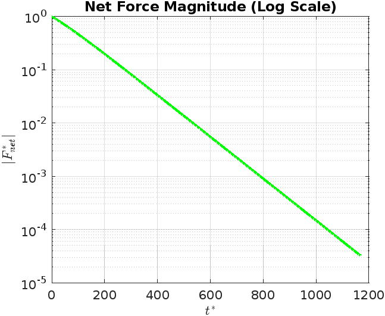

#  Droplet Terminal Velocity Simulation

## 📌 Objective

The goal of this project is to simulate the motion of a spherical water droplet falling through air, capturing the balance between gravity and drag forces, and identifying the terminal velocity. We examine both the transient behavior and the steady-state dynamics. Additionally, we explore how droplet radius and air density influence terminal velocity.

---

## ⚗️ Governing Equations

The motion of the droplet is governed by Newton’s Second Law:

    Net force = mass × acceleration

For a falling droplet in air:

    F_net = F_gravity - F_drag

Where:

- **F_gravity** = (rho_water - rho_air) × Volume × g  
  This accounts for buoyancy by subtracting the air density from the droplet’s density.

- **F_drag** = 0.5 × C_d × rho_air × A × v^2  
  The drag force depends on velocity, cross-sectional area (A), air density, and the drag coefficient (C_d).

The **Reynolds number (Re)** determines the drag coefficient:

    Re = (rho_air × v × D) / mu_air

And the **drag coefficient (C_d)** is modeled using:

- For Re < 1000:
  
      C_d = 24 / Re × (1 + 0.15 × Re^0.687)     (Schiller–Naumann correlation)

- For Re ≥ 1000:
  
      C_d = 0.44    (Turbulent regime assumption)

---

## 🧠 Physics Background

A droplet falling through a fluid experiences:
- **Gravitational Force (Fg)**: Acts downward due to the droplet's mass.
- **Buoyant Force**: Acts upward as the fluid displaces the droplet's volume.
- **Drag Force (Fd)**: Acts upward, increasing with the square of velocity.

As the droplet accelerates from rest, drag increases until it balances the net gravitational force (gravity minus buoyancy), at which point the droplet reaches terminal velocity and stops accelerating.

The drag coefficient depends on the Reynolds number (Re), so we apply the Schiller-Naumann model for Re < 1000 and use Cd = 0.44 for high Re regimes.

---
## 📈 Simulation Flowchart

Below is a logical overview of the simulation process, including decision points for Reynolds number and convergence checking:

## ⚙️ Code Implementation

The MATLAB script [`droplet_terminal_velocity_nd.m`](./droplet_terminal_velocity_nd.m) numerically integrates the equations of motion using an explicit Euler scheme. It also:
- Accounts for buoyancy in the gravity term
- Tracks force evolution (Fg, Fd, and net force)
- Normalizes time and velocity for analysis
- Generates all plots used in this report
- Computes terminal velocity for a range of droplet sizes and air densities in a 3D parametric study

---

## 📊 Results and Plot Analysis

### 1. Non-Dimensional Velocity vs Time

This plot shows the droplet velocity rising from rest and stabilizing at terminal velocity, normalized by the terminal velocity (v*) and characteristic time (t*).

**Insight**: Terminal velocity is reached asymptotically after a short transient phase, confirming expected drag-limited acceleration.

---

### 2. Gravitational vs Drag Force

This figure compares the constant gravitational force with the velocity-dependent drag force. The two converge as the droplet reaches terminal velocity.

**Insight**: Drag builds up until it matches the gravitational pull, illustrating force balance that defines terminal motion.

---

### 3. Net Force Driving Acceleration

This plot shows the normalized net force over time. It starts large and decays toward zero as the droplet accelerates.

**Insight**: The plot highlights the deceleration in acceleration (not velocity), due to the opposing drag force.

---

### 4. Net Force Magnitude (Log Scale)

Same net force, plotted on a logarithmic scale.

**Insight**: Exponential decay of net force confirms a characteristic of viscously damped systems, showing precise convergence toward steady state.

---

### 5. Terminal Velocity vs Radius and Air Density

This 3D surface shows how terminal velocity varies with droplet radius and air density.

**Insight**: Terminal velocity increases with droplet size and decreases with air density — exactly as expected from theoretical fluid dynamics.

---

## ✅ Summary of Outcomes

- The simulation captured accurate time-resolved dynamics of a falling droplet.
- Terminal velocity was identified numerically by tracking net force convergence.
- All physical trends (velocity rise, force balance, damping) were observed and validated.
- The parametric surface confirms theoretical dependence of terminal velocity on physical parameters.
- The use of non-dimensional analysis made the results more general and insightful.

---

## 🙌 Final Thoughts

This simulation combines classical fluid mechanics with numerical methods to analyze the motion of particles in a viscous medium. It is a valuable tool for understanding terminal velocity in aerosol science, rain droplet dynamics, and multiphase flows.

---

