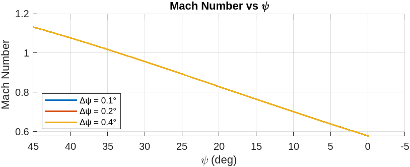
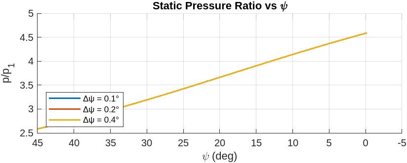
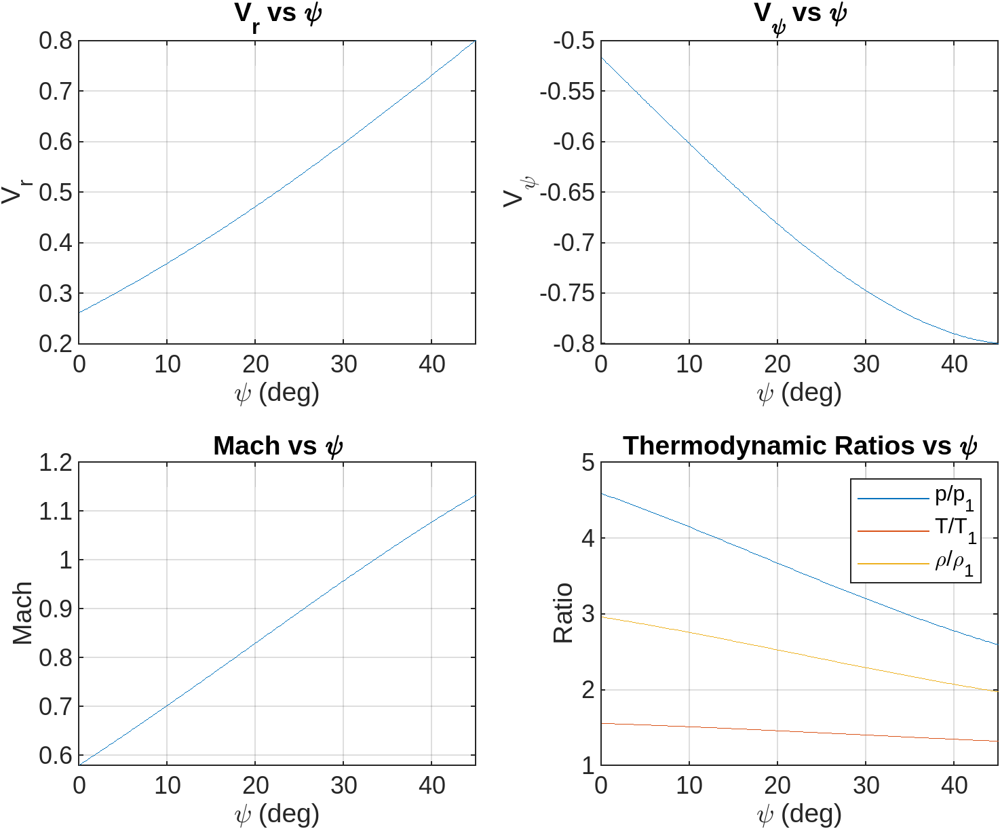

# Supersonic Flow Over a Cone – Taylor-Maccoll Analysis

**Author:** Dron Das Purkayastha  
**Domain:** Gas Dynamics (Compressible Flow)  
**Language:** MATLAB

---

## 📌 Objective

This project numerically analyzes the supersonic inviscid flow over a sharp cone using the Taylor-Maccoll method. The MATLAB code simulates the flow field between the conical shock and the cone surface and computes essential parameters such as cone semi-angle, Mach number, and pressure coefficient at the cone surface. The goal is to investigate flow behavior through grid convergence and flow variable distributions.

---

## 🛠️ Methodology Overview

The solver follows these steps:

- Computes post-shock conditions using oblique shock theory.
- Solves Taylor-Maccoll equations using the 4th-order Runge-Kutta method.
- Iterates through three angular step sizes (0.1°, 0.2°, 0.4°) to study grid convergence.
- Exports flow data as a CSV file for Δψ = 0.2°.
- Visualizes the flow using MATLAB plotting scripts.

---

## 📁 Files in the Repository

- `taylor_maccoll_analysis.m`: Main script that performs numerical integration, generates surface data, and plots Mach and pressure profiles.
- `visualize_flow_csv.m`: Reads and plots data from the CSV.
- `flow_data_dpsi_0_2.csv`: Flow variables for Δψ = 0.2°, used for detailed plotting.
- Plot images:
  - `machnumber-plot.png`
  - `staticpressure-plot.png`
  - `flow_distribution_plots.png`

---

## 📈 Simulation Flowchart

The figure below presents the full computational workflow for simulating supersonic flow over a cone using the Taylor–Maccoll equation. This project integrates classic compressible flow theory with modern numerical methods to capture high-speed conical shock interactions.

---

## 📊 Results and Analysis

### 🔹 Cone Surface Output

For each step size, the surface Mach number, cone angle, and pressure coefficient were printed. The values remain consistent for 0.1° and 0.2° step sizes, indicating good numerical convergence.

---

### 🔹 Plot: Mach Number vs Angular Position

**Interpretation:**  
This plot shows how Mach number decreases from the shock front to the cone surface. All three lines (Δψ = 0.1°, 0.2°, 0.4°) follow a similar profile, but the 0.4° line diverges slightly near the cone. This suggests that smaller step sizes yield more accurate solutions.

---

### 🔹 Plot: Static Pressure Ratio vs Angular Position

**Interpretation:**  
This figure shows the increase in static pressure as the flow moves from the shock to the cone. As expected, pressure increases due to the compressive nature of the flow. The overlap of curves further validates that Δψ = 0.1° and 0.2° provide consistent results.

---

### 🔹 Plot: Flow Variable Distribution from CSV Data

**Interpretation:**  
This multi-subplot visual shows the variation of:
- Radial velocity
- Angular velocity
- Mach number
- Pressure ratio
- Temperature ratio
- Density ratio

Each variable shows smooth, continuous changes indicating numerical stability. The trends are consistent with theoretical compressible flow behavior in conical shock systems.

---

## ✅ Conclusions

- The code successfully simulates the supersonic flow over a cone using Taylor-Maccoll theory.
- Grid convergence analysis confirms that smaller angular step sizes (0.1°, 0.2°) offer better accuracy.
- Flow variable profiles validate physical expectations in shock-cone interactions.
- The exported `.csv` enables flexible post-processing and visualization.

---

## ▶ How to Run

1. Open `taylor_maccoll_analysis.m` in MATLAB.
2. Run the script to generate the surface properties and two primary plots.
3. Open `visualize_flow_csv.m` to view the detailed flow variable plots.
4. Results are displayed in MATLAB and saved in the working directory.

---

## 📌 Author's Note

This project highlights the power of numerical integration and visualization in gas dynamics. It is an educational demonstration of compressible flow principles and numerical techniques in MATLAB.

---

